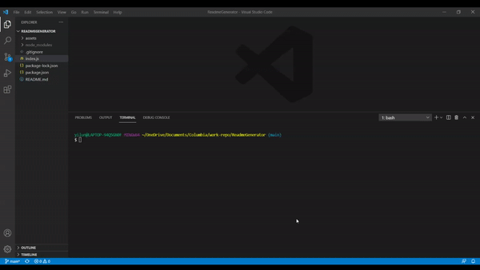
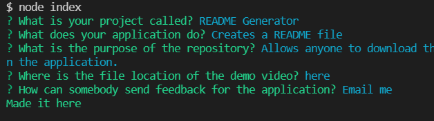

# README GENERATOR

## Function

An application which helps generate a README file using user inputs from the command line. The application will prompt the user with questions typically asked when somebody looks at a README file. This removes the need to know exact syntax and what to include for README files, and allows anybody to create a professional README in seconds. 

## Repository

This repository is created to allow for easy download and use of the project, and to let others improve on the file should they wish to. The files are public and anybody is free to modify the project on their local storage.

## Demo

Here is a short video on how to use the application.

The questions asked when the application is ran.

## Feedback

Feel free to contact me regarding any issues with the application or possible improvements.